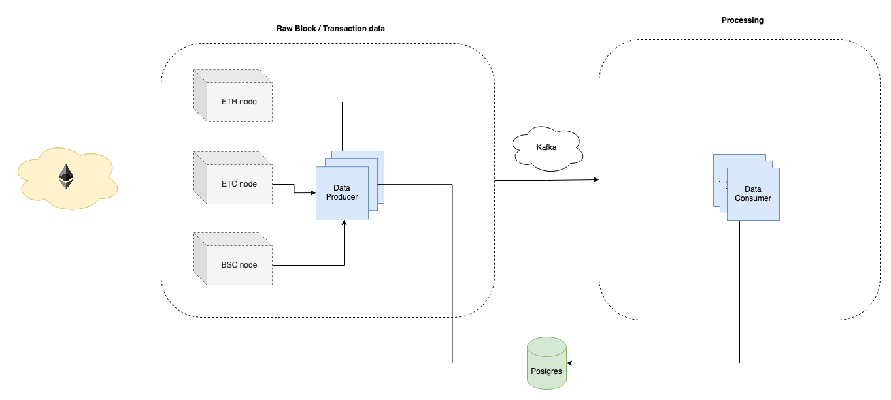

# Blockchain data collection and processing

## Overview
The app consists of four main components:
  * Data producer - scrape block data from the node and propagate transactions to a message queue
  * Data consumer - save relevant transactions to the database
  * Message queue - Kafka
  * Database - PostgreSQL



Consumers are blockchain agnostic (EVM compatible), thus only require a configuration file to specify which blockchain should be mined for data and stored later.

### Directory structure
```
.
├── README.md
├── docker-compose.dev.yml
├── docker-compose.prod.yml
├── docker-compose.tests.yml
├── docker-compose.yml
├── etc                         # misc. files and images
│   └── img
├── scripts                     # scripts for running the stack and tests
└── src                         # code for containers / services
    ├── data_collection         # producer + consumer code
    ├── db                      # dataschema definitions
    ├── kafka                   # kafka setup code
    └── zookeeper               # kafka orchestration service
```

## Running the stack
The application stack is managed by [docker compose](https://docs.docker.com/compose/#compose-v2-and-the-new-docker-compose-command). Each compose configuration file targets a different environment (dev, prod, tests).

> App has been tested on `Docker Compose version v2.14.0`.

Compose files should be started with run scripts that can be found in the `scripts/` directory. For long running tasks, you can start the run scripts in the background and keep the logs with:
```
$ bash scripts/run-prod-eth.sh > prod-eth.log 2>&1 &
```

### Configuration
Two main configuration files need to be updated accordingly to your use case.
1. `.env` = most of the general variables reused accross the application can be found here
2. `src/data_collection/etc/cfg/<environment>/<blockchain>.json` = environment, data collection and blockchain specific settings

Some of the values need to be updated in **both** configuration files, such as the full `node_url` or full `db_dsn`. Please check if updating one file doesn't require the update of some values in the other file before you continue.

#### 1. .env
To create an `.env` file you can copy the provided [`.env.default`](.env.default) and edit the values as needed. Description of all environment variables:
| ENV_VAR | Description | Default value |
|---|---|---|
| `PROJECT_NAME` | Prefix for docker network and container names | "bdc" |
| `DATA_DIR` | Destination directory for the data (PostgreSQL, Kafka, Zookeeper) | "/local/scratch/bdc/data" |
| `LOG_LEVEL` | logging level of consumers and producers | "INFO" |
| `N_CONSUMERS` | number of consumers to use for each blockchain | 2 |
| `DATA_UID` | Data directory owner ID (can be left blank) | `id -u` |
| `DATA_GID` | Data directory owner group ID (can be left blank) | `getent group bdlt \| cut -d: -f3` |
| `POSTGRES_PORT` | Published host port for PostgreSQL | 13338 |
| `POSTGRES_USER` | Username for connecting to PostgreSQL service | "username" |
| `POSTGRES_PASSWORD` | Password for connecting to PostgreSQL service | "postgres" |
| `POSTGRES_DB` | PostgreSQL default database | "db" |
| `KAFKA_N_PARTITIONS` | The number of partitions per topic | 100 |
| `ERIGON_PORT` | Port of the erigon node | 8547 |
| `ERIGON_HOST` | Host of the erigon node | "host.docker.internal" |

#### 2. cfg.json
FIXME: finish this section after adding "producer_type" for `config.py`

#### Additional configuration
On top of these two configuration files, the application stack can be ran simultaneously for multiple blockchains (or individually). This functionality is achieved via [`profiles`](https://docs.docker.com/compose/profiles/) in `docker compose`.

For example, running the app for specific blockchain on the production environment can be achieved via:
```
# ETH
$ bash scripts/run-prod-eth.sh
# ETC
$ bash scripts/run-prod-etc.sh
# BSC
$ bash scripts/run-prod-bsc.sh
```

### Environment
* Development = use for development and manual testing of new features
  * `$ bash scripts/run-dev.sh`
* Production = intended for use on Abacus-3, for final collection of data
  * `$ bash scripts/run-prod.sh`

Each of these environments has their own configuration `.json` files. For instance, for *development* you would find the configuration files in [`src/data_collection/etc/cfg/dev`](src/data_collection/etc/cfg/dev/). Similarly, the *production* environment config is in [`src/data_collection/etc/cfg/prod`](src/data_collection/etc/cfg/prod/).
There is a minor difference between a development and production environment besides the configuration files.

#### Differences between environments
* The docker compose for the production environment creates an NGINX reverse proxy service that allows connecting to the Erigon node running on Abacus-3. Historically, the development environment also used an in-memory database but that has been moved to a regular database to the main [docker-compose.yml](docker-compose.yml).
* Development environment always uses two replicas for each consumer. The production environment number can be set via `N_CONSUMERS` env var. If you would like fine grained control over the number of consumers for each blockchain, edit the replicas inside compose file directly.
* The `DATA_DIR` path environment variable in the development environment is modified by adding a `-dev` suffix.

> Note: If you very rarely encounter an `Error response from daemon: network` error, the volumes need to be fully restarted with `docker compose down --volumes --remove-orphans`.

## Running only the database
In case you only need to run the database on the host (e.g. on abacus-3 to access the data), use:
```
$ bash scripts/run-db.sh
```

This script will only start the database service (defined in [docker-compose.yml](docker-compose.yml)) as a standalone container.

For connecting to the database check [src/db/README.md](src/db/README.md).

## Tests

Currently, only the `DatabaseManager` class is tested. These database manager tests require an active database connection so the configuration in `docker-compose.tests.yml` starts an in-memory postgresql database along with the testing container.

To start the tests:
```
$ bash scripts/run-tests-db.sh
```

> Note: When running the tests locally, it might sometimes be necessary to `docker volume prune` in order for the database to restart properly.

---
## TLDR / FAQ
* How do I **start** this *locally* on my pc?
  1. configure `.env`
  2. configure `src/data_collection/etc/cfg/dev/<blockchain>.json` (depending on your blockchain)
  3. run `bash scripts/run-dev-<blockchain>.sh`
* How do I **start** this on *Abacus-3*?
  1. configure `.env`
  2. configure `src/data_collection/etc/cfg/prod/<blockchain>.json` (depending on your blockchain)
  3. run `bash scripts/run-prod-<blockchain>.sh`
* Does the run script **stop** / **cleanup** all the containers after the configured data collection is finished?
  * Yes. The consumers wait 2 minutes after the last received event before shutting themselves down. Producer closes immediately after the collection process has been finished. Other containers close when consumers and producers are down.
* **How many topics and consumers** should I use?
  * Depends on the machine you're running on, but generally the more consumers and topics, the faster the processing.
* Why does the production environment add an **Erigon proxy service** instead of just using `host.docker.internal` within the consumers / producers?
  * This reverse proxy is used as a workaround for the abacus-3 firewall. Currently the firewall rules only allow the default docker0 interface to send outbound requests to the host machine. This means that any container started with `docker run --add-host=host.docker.internal:host-gateway ...` will be able to reach the host. This works because the default docker network used for any `docker run` is the 'bridge' which has its default gateway set to the docker0 interface address. However, as soon as you attempt to do this inside of a docker compose (`extra_hosts: host.docker.internal:host-gateway`), it stops working. This is because the compose creates a separate docker network which has a random gateway address used for communication with the host. In theory, you could [set up a custom docker network with a static gateway address](https://stackoverflow.com/a/60245651/4249857) inside of the compose and add this address to the firewall rules, but that wasn't possible at the time of development.
* Why am I seeing `Unable connect to "kafka:9092": [Errno 111] Connect call failed ('<container_ip>', 9092)` in the logs?
  * The producers and consumers attempt to connect to the Kafka container as soon as they're started. However the Kafka container takes some time and is usually <15s but sometimes it takes a bit longer. These messages are generated by the internal kafka library that is used within the project and can be ignored.
* Why am I seeing `Group Coordinator Request failed: [Error 15] CoordinatorNotAvailableError` in the logs?
  * Another Kafka internal log that can be ignored, the coordinator is eventually selected and this error is irrelevant.
* Why am I seeing `Heartbeat failed for group eth because it is rebalancing` in the logs?
  * Another Kafka internal log that can be ignored.
