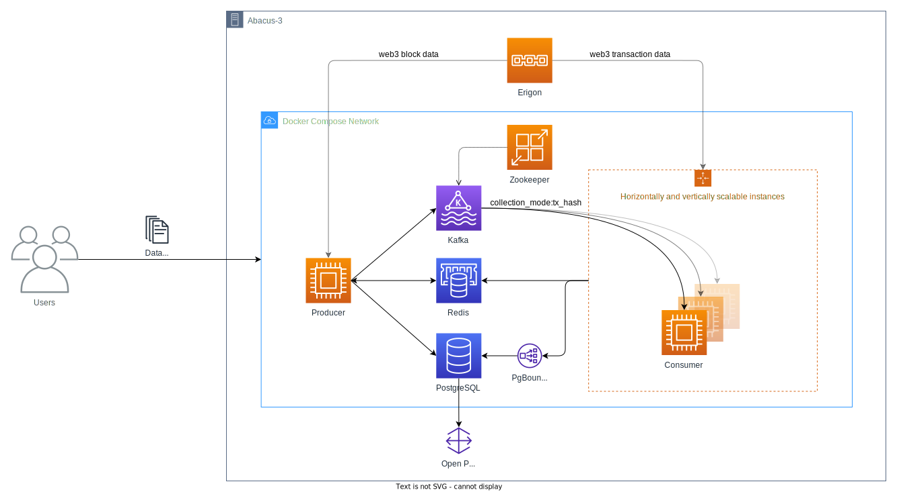

# EVM-compatible blockchain data collection

[](https://github.com/uzh-eth-mp/app/actions/workflows/test-unit.yaml?query=branch%3Adev)
[](https://github.com/uzh-eth-mp/app/actions/workflows/test-database.yaml?query=branch%3Adev)
[](https://handsdown.readthedocs.io/)
[](https://github.com/uzh-eth-mp/app/releases/)


A collection of Docker Containers for collecting EVM-compatible blockchain data.

* [Overview](#overview)
* [Directory Structure](#directory-structure)
* [Requirements](#requirements)
* [Usage](#usage)
  * [Quickstart](#quickstart)
  * [Deployment Environment](#deployment-environment)
  * [Configuration](#configuration)
  * [Scripts](#scripts)
  * [Extensions](#extensions)
  * [Querying data](#querying-data)
* [FAQ](docs/faq.md)
* [Contributing](docs/contributing.md)

## Overview



Main components (Docker containers):
  * Producer - scrape block data from the node and propagate transactions to Kafka
  * Consumers - save relevant transaction data to the database
  * Kafka - event store for transaction hashes
  * PostgreSQL - persistent data store
  * Redis - cache for orchestration data between producer and consumers

Producer and consumers are blockchain agnostic (EVM compatible), thus only require a configuration file to specify which blockchain should be mined for data.

## Directory structure
```
./
├── etc/                      # misc. files
├── scripts/                  # bash scripts for convenience
├── src/                      # code for containers
│   ├── data_collection/      # producer + consumer
│   ├── db/                   # postgresql
│   ├── kafka/
│   └── zookeeper/
├── README.md
├── docker-compose.dev.yml
├── docker-compose.prod.yml
├── docker-compose.tests.yml
└── docker-compose.yml
```

## Requirements
* [`docker compose`](https://docs.docker.com/compose/#compose-v2-and-the-new-docker-compose-command) (v2.14.0+)
  * to use with abacus-3: [install the compose plugin manually](https://docs.docker.com/compose/install/linux/#install-the-plugin-manually).

## Usage
### Quickstart
### Deployment Environment
### Configuration
### Scripts
### Extensions
#### Add new Event
Description of how to add an event goes here
#### Add new Contract ABI
Description of how to add a Contract ABI goes here
#### Support another blockchain
### Querying Data
### Running the stack
Compose files should be started with run scripts that can be found in the `scripts/` directory. For this you also need to have an `.env` file present. If you are cloning this directory, use `cp .env.default .env` and check all the env vars that you want to edit. Then:
```
$ bash scripts/run-prod-eth.sh
```

For long running tasks, you can start the run scripts in the background and keep the logs with:
```
$ bash scripts/run-prod-eth.sh > prod-eth.log 2>&1 &
```

### Configuration
Two main configuration files need to be updated accordingly to your use case.
1. `.env` = most of the general variables reused accross the application can be found here
2. `src/data_collection/etc/cfg/<environment>/<blockchain>.json` = environment, data collection and blockchain specific settings

Some of the values need to be updated in **both** configuration files, such as the full `node_url` or full `db_dsn`. Please check if updating one file doesn't require the update of some values in the other file before you continue.

#### 1. .env
To create an `.env` file you can copy the provided [`.env.default`](.env.default) and edit the values as needed. Description of all environment variables:
| ENV_VAR | Description | Default value |
|---|---|---|
| `PROJECT_NAME` | Prefix for docker network and container names | "bdc" |
| `DATA_DIR` | Persistent data destination directory (PostgreSQL, Kafka, Zookeeper) | "./data" |
| `LOG_LEVEL` | logging level of consumers and producers | "INFO" |
| `N_CONSUMERS` | number of consumers to use for each blockchain | 2 |
| `DATA_UID` | Data directory owner ID (can be left blank) | `id -u` |
| `DATA_GID` | Data directory owner group ID (can be left blank) | `getent group bdlt \| cut -d: -f3` |
| `POSTGRES_PORT` | Published host port for PostgreSQL | 13338 |
| `POSTGRES_USER` | Username for connecting to PostgreSQL service | "username" |
| `POSTGRES_PASSWORD` | Password for connecting to PostgreSQL service | "postgres" |
| `POSTGRES_DB` | PostgreSQL default database | "db" |
| `KAFKA_N_PARTITIONS` | The number of partitions per topic | 100 |
| `ERIGON_PORT` | Port of the erigon node | 8547 |
| `ERIGON_HOST` | Host of the erigon node | "host.docker.internal" |

#### 2. cfg.json
FIXME: finish this section after adding "mode" for `config.py`

Generating the latest pairs for a json configuration file can be done with:
```
$ python etc/get_top_uniswap_pairs.py -n 100
[
  {
    "address": "...",
    "symbol": "...",
    "category": "..."
  },
  {
    ...
  },
  ...
]
```

#### Additional configuration
On top of these two configuration files, the application stack can be ran simultaneously for multiple blockchains (or individually). This functionality is achieved via [`profiles`](https://docs.docker.com/compose/profiles/) in `docker compose`.

For example, running the app for specific blockchain on the production environment can be achieved via:
```
# ETH
$ bash scripts/run-prod-eth.sh
# ETC
$ bash scripts/run-prod-etc.sh
# BSC
$ bash scripts/run-prod-bsc.sh
```

### Environment
* Development = use for development and manual testing of new features
  * `$ bash scripts/run-dev.sh`
* Production = intended for use on Abacus-3, for final collection of data
  * `$ bash scripts/run-prod.sh`

Each of these environments has their own configuration `.json` files. For instance, for *development* you would find the configuration files in [`src/data_collection/etc/cfg/dev`](src/data_collection/etc/cfg/dev/). Similarly, the *production* environment config is in [`src/data_collection/etc/cfg/prod`](src/data_collection/etc/cfg/prod/).
There is a minor difference between a development and production environment besides the configuration files.

#### Differences between environments
* The docker compose for the production environment creates an NGINX reverse proxy service that allows connecting to the Erigon node running on Abacus-3. Historically, the development environment also used an in-memory database but that has been moved to a regular database to the main [docker-compose.yml](docker-compose.yml).
* Development environment always uses two replicas for each consumer. The production environment number can be set via `N_CONSUMERS` env var. If you would like fine grained control over the number of consumers for each blockchain, edit the replicas inside compose file directly.
* The `DATA_DIR` path environment variable in the development environment is modified by adding a `-dev` suffix.

> Note: If you very rarely encounter an `Error response from daemon: network` error, the volumes need to be fully restarted with `docker compose down --volumes --remove-orphans`.

## Running only the database
In case you only need to run the database on the host (e.g. on abacus-3 to access the data), use:
```
$ bash scripts/run-db.sh
```

This script will only start the database service (defined in [docker-compose.yml](docker-compose.yml)) as a standalone container.

For connecting to the database check [src/db/README.md](src/db/README.md).

## Tests

Currently, only the `DatabaseManager` class is tested. These database manager tests require an active database connection so the configuration in `docker-compose.tests.yml` starts an in-memory postgresql database along with the testing container.

To start the tests:
```
$ bash scripts/tests/run-tests-db.sh
```

> Note: When running the tests locally, it might sometimes be necessary to `docker volume prune` in order for the database to restart properly.
